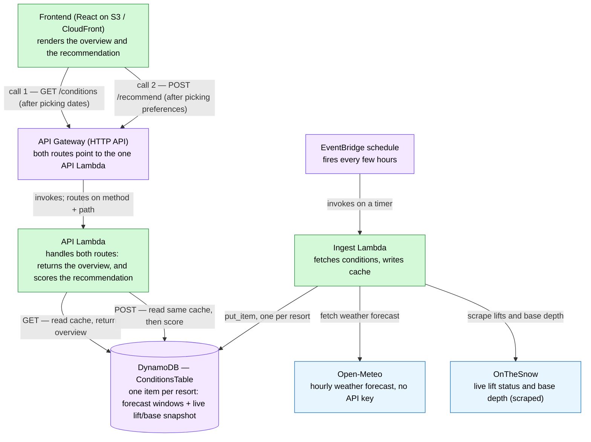
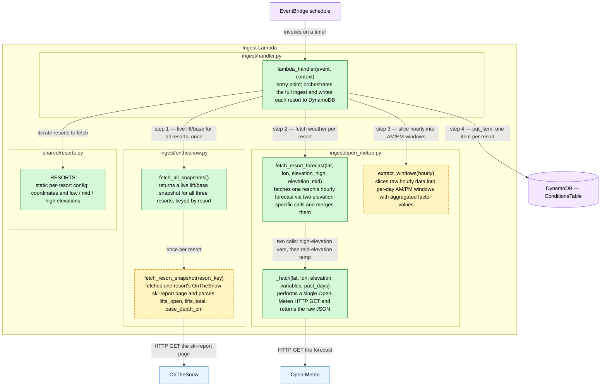
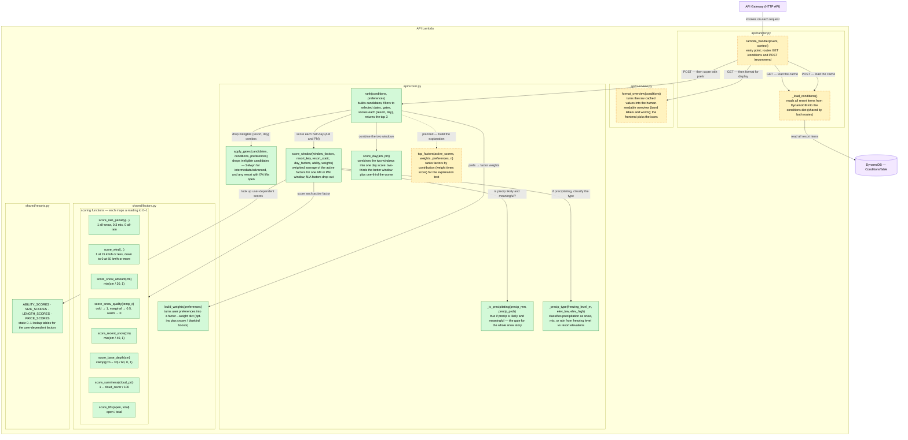

# Backend Design — Function Flow

> Living map of how the backend code fits together. Companion to
> [ARCHITECTURE.md](ARCHITECTURE.md) (system-level design and the scoring model)
> and [FACTORS.md](FACTORS.md) (per-factor detail). This doc is about the **code**:
> which function calls which, and why.

## How to read these diagrams

- **A box** is a deployable unit (a Lambda, DynamoDB, an external API). Inner
  boxes group functions by the **source file** they live in.
- **A node** is one function — its name plus a one-sentence description of what it
  does.
- **An arrow** is a function call (or data read/write); its **label says why** the
  call happens, or when.
- **Colour = build status:**

| Colour | Meaning |
|---|---|
| 🟩 green | implemented |
| 🟧 amber (dashed) | named but not yet implemented, or a stub with a `NotImplementedError` |
| 🟦 blue | external service (HTTP) |
| 🟪 purple | AWS-managed store / trigger |

Dashed **arrows** mark calls that are planned but not wired up yet.

---

## 1. System overview

The two Lambdas never talk to each other — they're decoupled through DynamoDB.
The ingest Lambda **writes** the cache on a timer; the API Lambda **reads** it on
request. This is the "split ingest from serving" decision in
[ARCHITECTURE.md](ARCHITECTURE.md).

---

## 2. Ingest Lambda

Triggered by EventBridge. `lambda_handler` orchestrates everything: it grabs the
live lift/base snapshot for all resorts once, then loops the resorts fetching and
slicing weather, and writes one item per resort to DynamoDB. The numbered labels
follow the order of execution.

**Note on the two stubs.** `extract_windows` is on the critical path — its output
shape is exactly what `scorer.score_window` reads back out of DynamoDB, so it
defines the DynamoDB item schema. `fetch_resort_snapshot` does the HTTP fetch
today but raises `NotImplementedError` on the parse until the page HTML is
confirmed.

---

## 3. API Lambda

Triggered by API Gateway. `GET /conditions` just returns the cached overview;
`POST /recommend` loads the cache and runs the scoring model with the user's
preferences. `scorer.rank` is the heart of it — everything below `rank` is the
scoring model from [ARCHITECTURE.md](ARCHITECTURE.md).

**Notes.**
- The two routes share `_load_conditions` (raw numbers) but diverge afterwards:
  `GET /conditions` → `format_overview` (raw → human-readable text); `POST
  /recommend` → `rank` (raw → scored ranking). `format_overview` returns the band
  words; the frontend maps each band to its icon.
- `build_weights` starts from `BASE_WEIGHTS` (also in `shared/factors.py`) and
  bumps individual weights per the preference answers.
- `top_factors` is written but its mapping from factor names to plain-English
  explanation strings is a TODO, and `rank` doesn't call it yet — hence the dashed
  arrow. Wiring it in is what turns each result into an expandable "why" card.
- `score_window` reads the resort-level values (lifts, base depth, ability, size,
  run length, price) once and feeds them into every window's average, so they
  differentiate resorts rather than days.
