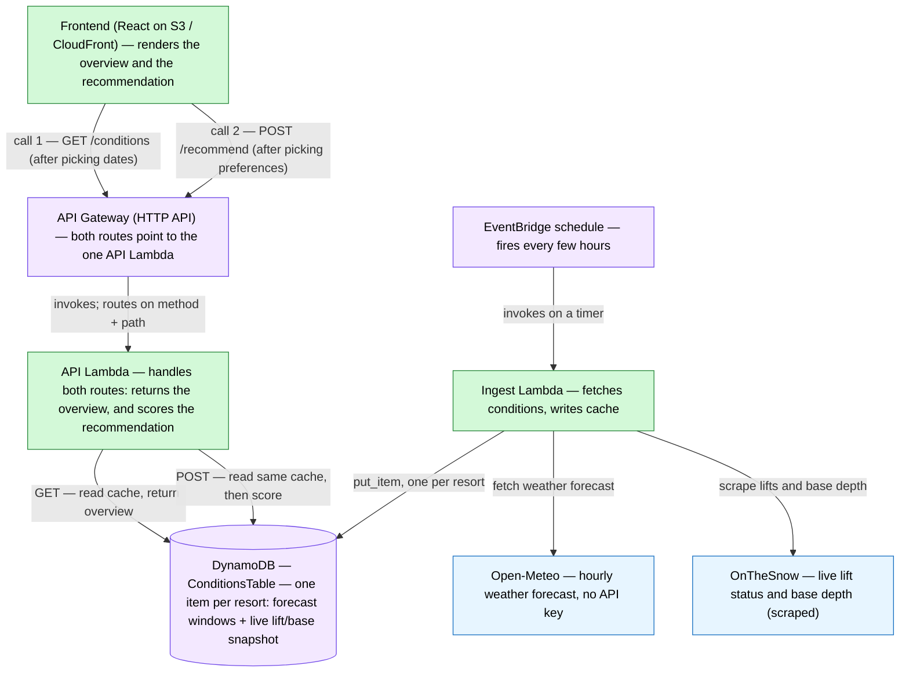
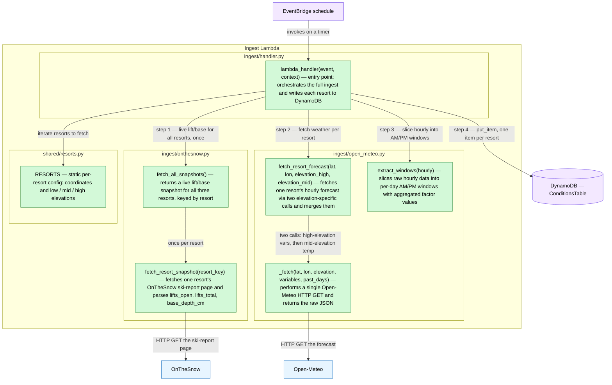
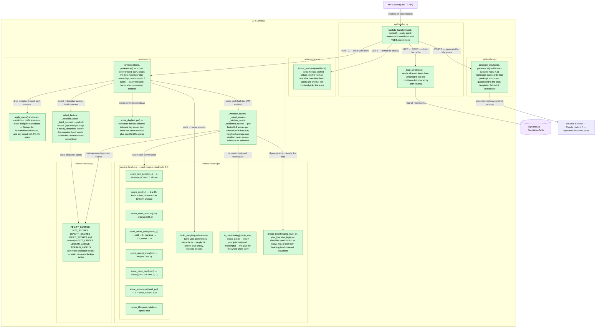

# Backend Design — Function Flow

> Living map of how the backend code fits together. Companion to
> [ARCHITECTURE.md](ARCHITECTURE.md) (system-level design and the scoring model)
> and [FACTORS.md](FACTORS.md) (per-factor detail). This doc is about the **code**:
> which function calls which, and why.

## How to read these diagrams

- **A box** is a deployable unit (a Lambda, DynamoDB, an external API). Inner
  boxes group functions by the **source file** they live in.
- **A node** is one function — its name plus a one-sentence description of what it
  does.
- **An arrow** is a function call (or data read/write); its **label says why** the
  call happens, or when.
- **Colour = build status:**

| Colour | Meaning |
|---|---|
| 🟩 green | implemented |
| 🟧 amber (dashed) | named but not yet implemented, or a stub with a `NotImplementedError` |
| 🟦 blue | external service (HTTP) |
| 🟪 purple | AWS-managed store / trigger |

Dashed **arrows** mark calls that are planned but not wired up yet.

---

## 1. System overview

The two Lambdas never talk to each other — they're decoupled through DynamoDB.
The ingest Lambda **writes** the cache on a timer; the API Lambda **reads** it on
request. This is the "split ingest from serving" decision in
[ARCHITECTURE.md](ARCHITECTURE.md).

---

## 2. Ingest Lambda

Triggered by EventBridge. `lambda_handler` orchestrates everything: it grabs the
live lift/base snapshot for all resorts once, then loops the resorts fetching and
slicing weather, and writes one item per resort to DynamoDB. The numbered labels
follow the order of execution.

**Note on `extract_windows`.** It's on the critical path — its output shape is
exactly what the scorer's per-window scoring reads back out of DynamoDB, so it defines the
DynamoDB item schema.

**Note on `fetch_resort_snapshot`.** OnTheSnow is a Next.js app: every ski-report
page server-renders with all its data in one `<script id="__NEXT_DATA__">` JSON
blob. We parse `props.pageProps.fullResort` out of that blob (lift counts +
per-band depths in cm) rather than scraping rendered divs — it's the resort's own
structured data, so no unit conversion and far less fragile than div-scraping.
Base depth is reported per elevation band; we take the first present in base →
middle → summit order.

---

## 3. API Lambda

Triggered by API Gateway. `GET /conditions` just returns the cached overview;
`POST /recommend` loads the cache and runs the scoring model with the user's
preferences. `scorer.rank` is the heart of it — everything below `rank` is the
scoring model from [ARCHITECTURE.md](ARCHITECTURE.md). Arrows are numbered per
route (**GET 1–2**, **POST 1–3**), like the ingest diagram.

**Notes.**
- The two routes share `_load_conditions` (raw numbers) but diverge afterwards:
  `GET /conditions` → `format_overview` (raw → human-readable text); `POST
  /recommend` → `rank` (raw → scored ranking). `format_overview` returns each
  factor's band word **plus its raw number**, so the frontend can show the word,
  the figure, or both, and maps each band to its icon (laid out as aligned dot
  points). N/A factors are omitted from a window, mirroring how they drop out of
  the scoring model.
- `is_precipitating` and `precip_type` live in `shared/factors.py` and are called
  by **both** the scorer's per-window scoring and `format_overview` — one definition
  of the precip gate and the snow/mix/rain split, so the overview and the
  recommendation can never disagree about whether it's snowing.
- **`rank` returns cards, not raw scores.** One card per day (best resort that day,
  top 3 days). Each card carries an **8-factor why** — `select_factors` takes the
  top 4 by weight + top 4 by score (static resort factors eligible as fillers),
  and `_describe_factor` reuses `overview.py`'s band-word helpers so the why speaks
  the same vocabulary as the overview (weather factors carry both AM and PM). The
  **contrast** (`_build_contrast`) compares the runner-up resort on 2 factors,
  preferring ones whose band word actually differs so it reads as a real difference.
- **`generate_why` (built).** `POST /recommend` passes `rank`'s cards to
  `explain.generate_why`, which sends all cards' fact packages in **one** Bedrock
  call to **Claude Haiku 4.5**, strictly prompted to use only the supplied facts
  (the deterministic facts are the anti-hallucination guardrail), and attaches a
  `why` paragraph per card. The SDK import and client are lazy so the module loads
  without the dep; any failure (missing SDK/creds, unparseable response) logs and
  falls back to a templated join of the same facts, so the route never fails. The
  live Bedrock call still needs validating against a real endpoint at deploy
  (model access enabled + region), which local tests can't exercise.
- `build_weights` starts from `BASE_WEIGHTS` (also in `shared/factors.py`) and
  bumps individual weights per the preference answers.
- Resort-level factors (lifts, base depth, ability, size, run length, price) are
  scored once by `_resort_scores` and fed into **every** window's weighted average,
  so they differentiate resorts rather than half-days.
- **A few shared-lookup edges are omitted from the diagram** to keep the flow
  readable: `format_overview` also reuses the `is_precipitating` / `precip_type`
  helpers and the resorts' character labels, and the scorer's `_describe_factor`
  reuses `overview.py`'s band-word helpers (both covered in the notes above).
