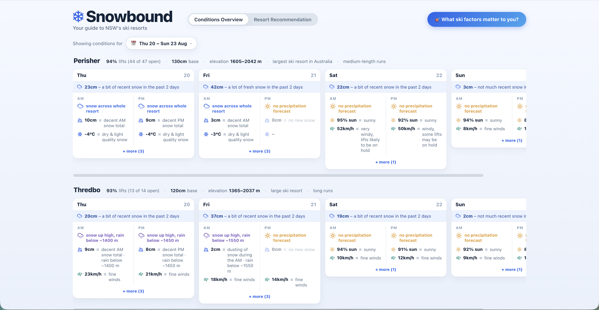
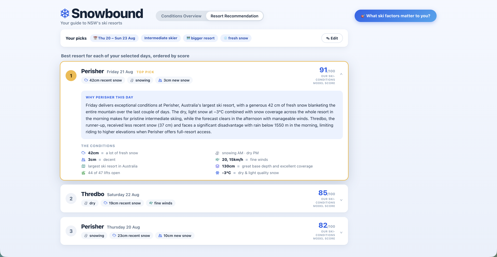

# Snowbound 🏔️

**A decision-support app that tells you where to ski this weekend — and explains why.**

> Your guide to NSW's ski resorts. Live conditions in, a ranked recommendation out.

🔗 **Live demo:** http://nsw-snowbound.s3-website-ap-southeast-2.amazonaws.com

---

## A look at it

| Conditions Overview | Resort Recommendation |
|---|---|
|  |  |
| *Neutral, per-resort conditions for the days you picked.* | *Ranked recommendation with an expandable, LLM-generated explanation.* |

---

## The problem

Planning a ski weekend from Sydney means checking the same three NSW resorts
(Perisher, Thredbo, Selwyn) across a handful of weather sites, mentally juggling
snowfall, wind, freezing levels, lift closures and ticket prices — and then
guessing. Every weather app shows you *data*; none of them answer the actual
question: **"where should I go, and which day?"**

Snowbound answers that question. You pick the days you *could* ski and what
matters to you (ability, fresh snow vs. bluebird sun, cost, terrain), and it
returns a **ranked recommendation of the best resort per day** with a
**plain-language explanation of the reasoning** — not a dashboard you still have
to interpret.

## What it does

1. **Pick your days** — a date range up to 10 days out (the useful forecast horizon).
2. **Conditions Overview** — a neutral, per-resort / per-day view of live and
   forecast conditions. No opinion yet, just the facts, laid out consistently.
3. **Tell it what matters** — a short preferences wizard: ability level, cost
   sensitivity, terrain size, run length, and whether you're chasing powder or sun.
4. **Recommendation** — the best resort for each of your top days, ranked, as
   expandable cards: a one-line headline, expandable to the full "why."

The recommendation is **preference-aware**: the same conditions produce a
different answer for a budget-conscious beginner than for an advanced skier
chasing fresh snow.

## Why this project

I built Snowbound as a from-scratch, end-to-end product to demonstrate the
things a **Forward Deployed / Solutions Engineer** actually does day to day:

- **Take a fuzzy real-world problem and ship a working product** — frontend,
  backend, data pipeline, cloud infrastructure, and an LLM integration, deployed
  and live.
- **Make deliberate architecture decisions and be able to defend them** — every
  choice below has a "why," and an honest "here's the tradeoff I accepted."
- **Integrate an LLM responsibly** — using a model where it adds value
  (readable prose) while engineering hard guardrails against the thing everyone
  worries about (hallucination).
- **Communicate technical reasoning clearly** — the whole repo is documented as
  if handing it to a customer's engineering team.

---

## Architecture

Serverless throughout, on AWS, deployed as infrastructure-as-code.

```
                         ┌──────────────────────────────┐
                         │  Browser — React + Vite SPA   │
                         │  (Conditions ⇄ Recommendation)│
                         └───────────────┬───────────────┘
                                         │  HTTPS (JSON)
                    S3 static hosting    │
        ┌────────────────────────────────┼────────────────────────────┐
        │                                 ▼                            │
        │                    ┌────────────────────────┐               │
        │                    │  API Gateway (HTTP API) │               │
        │                    └────────────┬───────────┘               │
        │                                 ▼                            │
        │                    ┌────────────────────────┐               │
        │                    │   API Lambda (Python)   │               │
        │                    │  scoring model + "why"  │──► Bedrock    │
        │                    └────────────┬───────────┘   (Haiku 4.5) │
        │                                 ▼                            │
        │                    ┌────────────────────────┐               │
        │                    │        DynamoDB         │  latest cached│
        │                    │   (conditions cache)    │  conditions   │
        │                    └────────────▲───────────┘               │
        │                                 │                            │
        │       EventBridge schedule ─► Ingest Lambda (Python)         │
        │       (every 3h)              fetches + derives conditions   │
        └─────────────────────────────────────────────────────────────┘
                                         │
                          ┌──────────────┴───────────────┐
                          ▼                               ▼
                   Open-Meteo API                   OnTheSnow
              (snowfall, temp, wind,           (open-lift %, base depth
               freezing level, cloud)           — scraped snapshot)
```

**The key design decision: split ingest from serving.** A scheduled Lambda
fetches and caches conditions in DynamoDB on a timer; the request-path Lambda
only ever reads the cache. This keeps user requests fast, avoids hammering (and
getting rate-limited by) the upstream data sources on every page load, and
cleanly decouples "getting data" from "serving answers." It's the same
read-through-cache pattern you'd reach for at scale, sized down to a personal app.

## The interesting part: grounded LLM explanations

The explanation prose is generated by **Claude Haiku 4.5 via Amazon Bedrock** —
but with a strict separation of concerns designed to make hallucination
structurally impossible:

- A **deterministic Python scorer** does all the reasoning. It selects which
  facts to mention (the factors that matter most to *this* user plus the most
  favourable conditions), describes each in fixed "band words" (e.g. *"15–20 cm
  fresh snow, morning"*), and computes a contrast against the runner-up resort.
- **Bedrock only rephrases those exact facts into flowing prose** — strictly
  prompted to add nothing, invent nothing, change no numbers. The LLM is a
  *writer*, never a *reasoner*.
- If Bedrock is unavailable, it **falls back to a templated join** of the same
  facts, so `/recommend` never fails.

The result reads naturally but is provably faithful to the computed scores —
every fact in the prose was pre-computed by code. Haiku is deliberately
right-sized: constrained rephrasing doesn't need a frontier model.

> This is the pattern I'd bring to a customer worried about putting an LLM in
> front of users: **let the LLM do the language, never the truth.**

## The scoring model

Transparent weighted scoring — no black box. Each of 11 factors maps to a 0–1
desirability score and carries a weight; the user's preferences adjust the
weights; scores are combined per `(resort, day)` and ranked.

- **Factors:** snowfall, rain-vs-snow (via freezing level), snow quality,
  recent snow, base depth, wind, sun/cloud, open-lift %, ability match, resort
  size, run length, and price.
- **Preference-driven weighting:** e.g. picking "chasing powder" boosts fresh
  snow; "bluebird" boosts sun; cost sensitivity switches price on.
- **Domain rules baked in:** Selwyn (beginner-only terrain) is excluded for
  intermediate/advanced skiers; a resort with 0% lifts open is vetoed entirely;
  sun is dropped as a factor on snowing days (a powder day shouldn't be marked
  down for cloud).
- **Day score** leans toward the better half-day (⅔ better window + ⅓ worse) —
  a great morning still makes a great day.

Full factor-by-factor spec, data sources, and scoring curves are in
[FACTORS.md](FACTORS.md); the model and its design decisions are in
[ARCHITECTURE.md](ARCHITECTURE.md).

---

## Tech stack

| Layer | Choice | Why |
|---|---|---|
| **Frontend** | React + Vite (static SPA) | Component model + a build that drops straight onto S3. CSS Modules for scoped styling, no framework sprawl. |
| **Backend** | Python on AWS Lambda | Right tool for the fetch + scoring logic; **zero pip dependencies** (stdlib + runtime boto3), so no containers to build. |
| **API** | API Gateway (HTTP API) | Thin, cheap HTTP front door for the Lambdas. |
| **Data store** | DynamoDB | Simple key-value cache of the latest conditions per resort. |
| **Scheduled ingest** | EventBridge → Lambda | Timer-driven fetch, decoupled from the request path. |
| **LLM** | Amazon Bedrock (Claude Haiku 4.5) | Grounded prose generation with a templated fallback. |
| **Hosting** | S3 static website hosting | See tradeoff below. |
| **IaC** | AWS SAM | Purpose-built for this serverless shape; whole stack is reproducible from `template.yaml`. |

## Engineering decisions & tradeoffs

Being able to articulate *why*, and what I gave up, is the point of this project:

- **Serverless, not a server.** No instance to patch or scale; the app costs
  effectively nothing at rest (only Bedrock tokens cost anything — cents).
  Tradeoff: cold starts, which are irrelevant for this traffic profile.
- **Plain S3 hosting over S3 + CloudFront.** Both are free at this scale. I
  chose plain S3 and consciously accepted **HTTP-only, no CDN** — for a personal
  project with no logins and no sensitive data, the HTTPS/edge-caching benefits
  were overkill. CloudFront is the documented upgrade path the moment the app
  needs HTTPS, a custom domain, or global latency.
- **Read-through cache.** Upstream data is fetched on a schedule and cached, not
  fetched per request — protects fragile scraped sources and keeps latency low.
- **Scraping accepted as fragile.** Australian resorts have no clean lift-status
  API, so open-lift % and base depth are scraped from OnTheSnow's embedded JSON.
  I treat this as a known-fragile dependency, isolated to the ingest Lambda, for
  a deliberately short-lived app.
- **LLM for language, code for truth** — the grounded-explanation design above.

---

## Repository layout

```
backend/
  shared/     resort data + factor classification & scoring (packaged as a SAM layer)
  ingest/     scheduled fetch: Open-Meteo (urllib) + OnTheSnow → DynamoDB
  api/        GET /conditions (overview) + POST /recommend (ranked cards + Bedrock "why")
frontend/     React + Vite SPA (CSS Modules; state in App.jsx, props down)
template.yaml AWS SAM — the entire stack as infrastructure-as-code
```

## Running it locally

**Frontend** (from `frontend/`):

```bash
npm install
npm run dev      # http://localhost:5173
npm run build    # production build → frontend/dist/
```

**Backend / infra** (from repo root, needs the AWS SAM CLI + local `python3.12`):

```bash
sam build
sam deploy       # deploys the full serverless stack to ap-southeast-2
```

## Documentation

This repo is documented as if handing it to another engineer:

- **[ARCHITECTURE.md](ARCHITECTURE.md)** — how the app works, data flow, the
  scoring model, and the reasoning behind each choice.
- **[FACTORS.md](FACTORS.md)** — every decision factor: what it is, why it
  matters, its data source, and how it scores.
- **[FRONTEND_DESIGN.md](FRONTEND_DESIGN.md)** — the frontend component tree and
  visual spec.
- **[RESORT_DATA.md](RESORT_DATA.md)** — the static per-resort data.

---

*Built as a portfolio project to demonstrate end-to-end product delivery on AWS:
turning a real problem into a live, serverless, LLM-assisted application — and
being able to explain every decision in it.*
